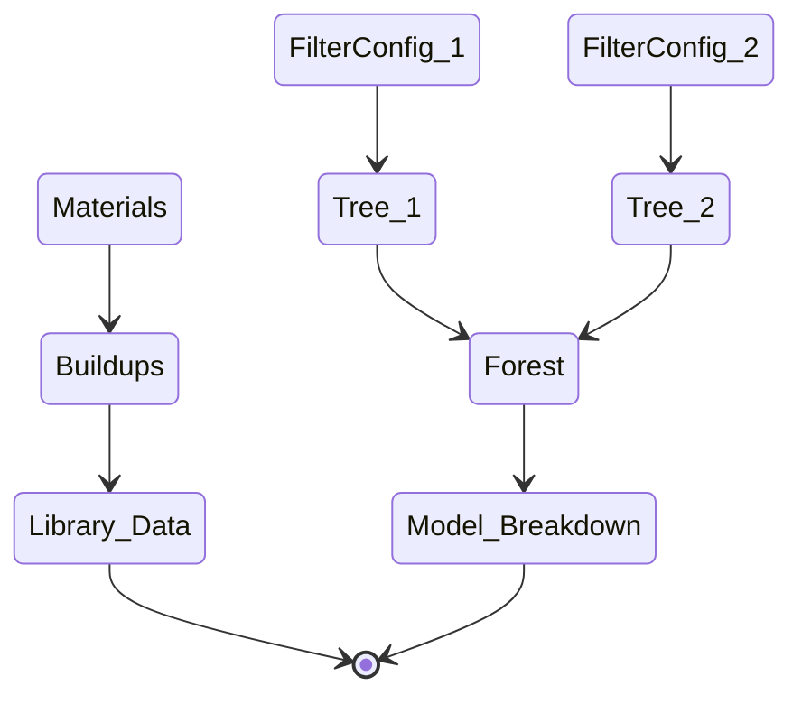
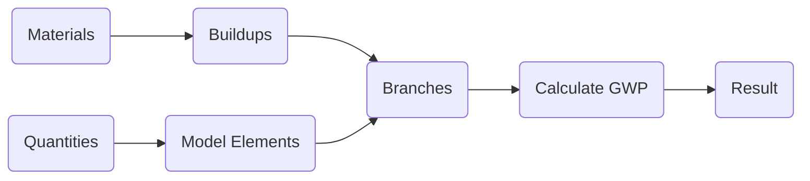
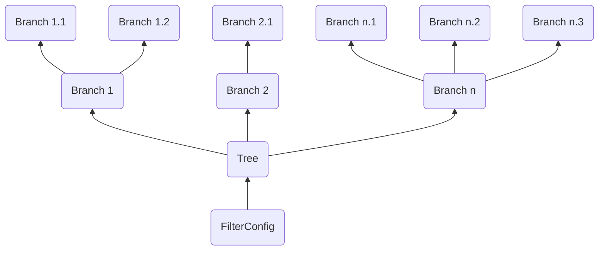
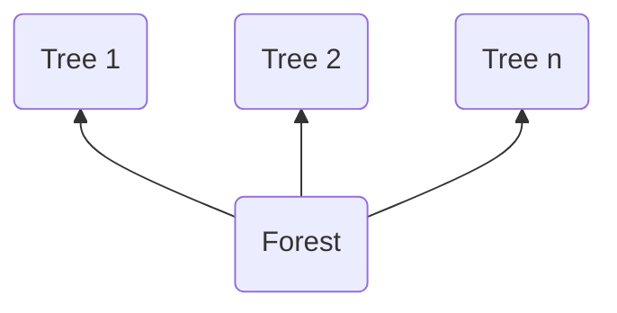
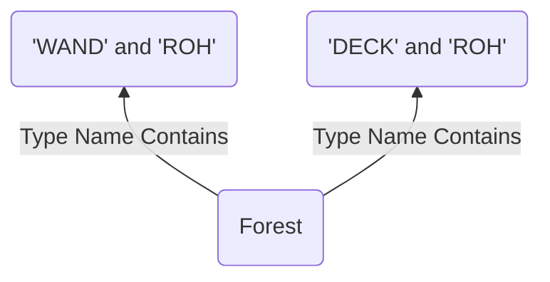
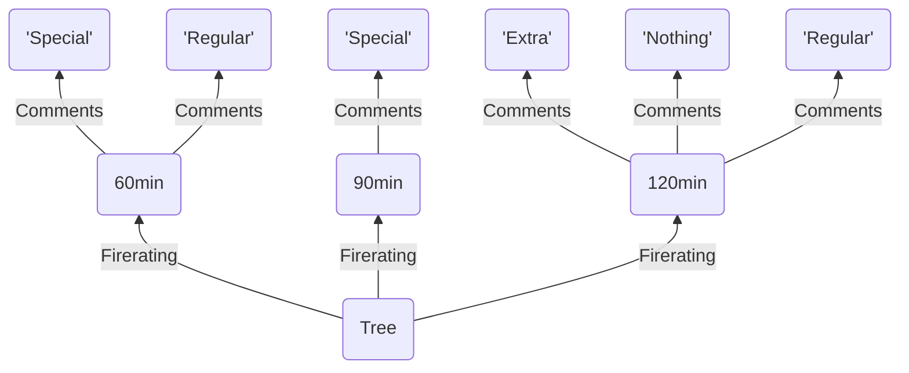
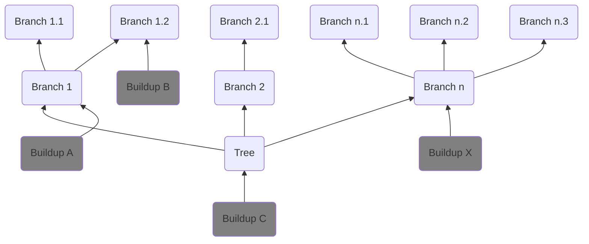

# Calc

## Content

- [Capabilites](#capabilities)
- [Method](#method)
- [Process](#process)
- [About this Repo](#repository)

## Capabilities

### Calc is a calculation tool for 3d models:
1. You create **materials** with any numerical information you want to calculate (e.g. KgCO2e, Cost, ...).
2. You **combine** them into **buildups**.
3. You customize **filters** to create **groups** of model **elements**, 
you break down the groups into sub-groups.
4. You **assign** buildups to **groups** or **sub-groups**.
5. You **vizualize** the calculation results with **CalcLive**.
6. You **save** the **results** to a central location to **compare** them **later**.

### Calc can adapt to:
- Any 3d Authoring Software
- Any Modelling Standard
- Any Data Source
- Any Visualization Medium

### Current ecosystem:
Authoring Softwares:
- Revit (2022, 2023)

Data Sources:
- Directus

Visualization:
- CalcLive (Website)
- PowerBI

### Current Calculations:
- Life Cycle Assessment (LCA, KgCO2e[A1, A2, A3])
- Cost (Any Currency)

## Life Cycle Assessment

*Life Cycle Assessment (LCA) is a tool used in architectural design to evaluate the environmental impacts of a building throughout its entire lifespan. It assesses factors like energy use, emissions, and waste generation from raw material extraction to demolition. By considering the life cycle perspective, architects can make informed decisions to minimize environmental burdens and create sustainable designs. LCA helps optimize building designs and promotes environmentally responsible practices in architecture.*

Calc allows you to enter unit-rate KgCO2e for materials in your library 
and perform calculations based on model quantities.
This tool currently focusses on Global Warming Potential (GWP, KgCO2e) in the phases A1, A2 and A3.

## Cost

Calc allows you to enter unit-rate cost for materials in your library 
and perform calculations based on model quantities.

# Method

## Goal

1. A full or partial mapping of model element groups to buildups from a library.
2. Calculate KgCO2e per element according to unit rate from the buildup.
3. Break-down or summarize result live.
4. Benchmark against previous projects.

## Usability

LCA analysis is mostly a data centric task which inherently means:

> Beware: :warning: Junk in -> Junk out :warning:   

Usability in this case means perfect control over your data.

> Control <- Understanding <- Visualization


## Terminology

Designing a tool that works for modelling standards around the globe is a challengeing task.
This method aims to be as simple as possible while mainaining maximum flexibility.
To explain how it works, we need to introduce a few terms:
- [Forest](#forest)
- [Tree](#trees)
- [FilterConfig](#trees)
- [Branch](#branches)
- [Buildup](#buildups)
- [Mapping](#the-mapping)
- [Calculation Result](#results)

# Process

This guide attempts to explain the underlying logic of the [direcuts-lca](https://github.com/herzogdemeuron/directus-lca) class library. Understanding this is the main prerequisite for making you own front end applications like [revit-lca](https://github.com/herzogdemeuron/revit-lca)

The process is structured in two parts, where 1 is prerequisite to 2.
1. [Library Data](#library-data)
2. [Model Breakdown](#Model-Breakdown)



## Library Data

:grey_question: Why bother to make a central library for materials and buildups? Revit already has types and materials!

>- Revit does, Rhino does not.  
>- Determining the GWP of a material requires certain knowledge.   
>- Determining the kind and quantity of materials that make up a builup requires certain knowledge.   
>- We suggest that the materials and buildups you make available in your organization are **managed centrally by an expert**.   
>- We see a strong analogy to cost calculation.

### Materials

A material is exaclty what the name suggests: A single building material.  The material definition can be sourced from any reputable source there is. It can be estimated, averaged or copied from a database / EPD (Environmental Product Declarations). 
You are in charge.

Common sources are:
- OEKOBAUDAT (Germany)
- KBOB (Switzerland)
- EC3 (USA)
- LCAByg (Denmark)
- EPD's (Manufacturer)

> The expert is responsible for the relevancy of the associated GWP.

### Buildups

A buildup defines the GWP of one reference unit for a certain model element.
The reference units for a buildup are:
- Per piece (each)
- Cubic meters (m3)
- Square meters (m2)
- Meters (m)

A buildup is made up from one or more [Materials](#materials). Each material has a quantity associated, which tell you how much of this material is used per reference unit of the buildup.

### Results



## Model Breakdown

Breaking down the model into chunks of elements in a hierarchial manner allows us to map buildups to these chunks and/or override the mapping of a parent chunk by mapping a buildup to a sub-chunk.  
We chose the analogy of a forest full of trees with branches to make it easier to visualize what's happening.



### Forest

A **Forest** is a set of **Trees**:



A forest can be **saved** and **loaded**, this is the included information:
```json
[
    {
        "Name": "Tree1",
        "FilterConfig": {
            "operator": "and",
            "conditions": [
                {
                    "type": "SimpleCondition",
                    "operator": null,
                    "conditions": null,
                    "condition": {
                        "parameter": "Type Name",
                        "method": "contains",
                        "value": "WAND"
                    }
                },
                {
                    "type": "SimpleCondition",
                    "operator": null,
                    "conditions": null,
                    "condition": {
                        "parameter": "Type Name",
                        "method": "contains",
                        "value": "ROH"
                    }
                }
            ]
        },
        "BranchConfig": [
            "Grouping",
            "SubGrouping"
        ]
    },
    {
        "Name": "Tree2",
        "FilterConfig": {
            "operator": "and",
            "conditions": [
                {
                    "type": "SimpleCondition",
                    "operator": null,
                    "conditions": null,
                    "condition": {
                        "parameter": "Type Name",
                        "method": "contains",
                        "value": "DECK"
                    }
                },
                {
                    "type": "SimpleCondition",
                    "operator": null,
                    "conditions": null,
                    "condition": {
                        "parameter": "Type Name",
                        "method": "contains",
                        "value": "ROH"
                    }
                }
            ]
        },
        "BranchConfig": [
            "Grouping",
            "SubGrouping"
        ]
    }
]
```

### Trees

A **Tree** defines a high level grouping of alike elements. It encapsulates the logic that unites these elements. That logic is called **FilterConfig**. The FilterConfig shown in the example above produce a forest like this:



### FilterConfig

The filter config determines which elements will end up in a tree.
The JSON configuration follows a specific structure to define the filter conditions:

```json
{
    "operator": "and",
    "conditions": [
        {
            "type": "GroupCondition",
            "operator": "or",
            "conditions": [
                {
                    "type": "SimpleCondition",
                    "condition": {
                        "parameter": "<Parameter Name>",
                        "method": "<Comparison Method>",
                        "value": "<Comparison Value>"
                    }
                },
                {
                    "type": "SimpleCondition",
                    "condition": {
                        "parameter": "<Parameter Name>",
                        "method": "<Comparison Method>",
                        "value": "<Comparison Value>"
                    }
                }
                // Add more SimpleConditions or GroupConditions if needed
            ]
        },
        {
            "type": "SimpleCondition",
            "condition": {
                "parameter": "<Parameter Name>",
                "method": "<Comparison Method>",
                "value": "<Comparison Value>"
            }
        }
        // Add more SimpleConditions or GroupConditions if needed
    ]
}
```

Explanation:

- **type:** Indicates whether the condition is a "SimpleCondition" or a "GroupCondition". SimpleCondition represents a single condition on a parameter, while GroupCondition allows grouping multiple conditions together with either "and" or "or" logical operators.
- **conditions:** Represents a list of conditions that are either SimpleConditions or GroupConditions. Each condition can be a standalone condition or part of a group of conditions.
- **operator:** Specifies the logical operator used to combine conditions within a group (e.g., "and" or "or"). For example, conditions inside a GroupCondition with the "or" operator will be satisfied if at least one of them evaluates to true.
- **parameter:** The name of the parameter on which the condition will be evaluated.
- **method:** The comparison method used to evaluate the parameter against the specified value. 
- **value:** The value used for the comparison.

Filter Methods

- **Equals:** Check if the field value is equal to the specified value.
- **NotEquals:** Check if the field value is not equal to the specified value.
- **Contains:** Check if the field value contains the specified value (as a substring).
- **NotContains:** Check if the field value does not contain the specified value (as a substring).
- **StartsWith:** Check if the field value starts with the specified value.
- **NotStartsWith:** Check if the field value does not start with the specified value.
- **EndsWith:** Check if the field value ends with the specified value.
- **NotEndsWith:** Check if the field value does not end with the specified value.
- **GreaterThan:** Check if the field value is greater than the specified value (numeric comparison).
- **GreaterThanOrEqualTo:** Check if the field value is greater than or equal to the specified value (numeric comparison).
- **LessThan:** Check if the field value is less than the specified value (numeric comparison).
- **LessThanOrEqualTo:** Check if the field value is less than or equal to the specified value (numeric comparison).

Please note that the availability of these filter methods depends on the data type of the parameter value being filtered. Ensure that the correct method is used based on the data type and desired filtering behavior.

Example use:
```json
{
    "operator": "and",
    "conditions": [
        {
            "type": "GroupCondition",
            "operator": "or",
            "conditions": [
                {
                    "type": "SimpleCondition",
                    "condition": {
                        "parameter": "Foo",
                        "method": "contains",
                        "value": "a"
                    }
                },
                {
                    "type": "SimpleCondition",
                    "condition": {
                        "parameter": "Foo",
                        "method": "equals",
                        "value": "b"
                    }
                }
            ]
        },
        {
            "type": "SimpleCondition",
            "condition": {
                "parameter": "Bar",
                "method": "equals",
                "value": "c"
            }
        }
    ]
}
```

### Branches

A tree can also define (optionally) by what property the alike element should be sub-grouped. The resulting sub-groups are called **Branches**.

Every **Branch** can have Subbranches. What elements belong to each subbranch is determined by their value of the property that is used to create the subbranches. This logic is called **BranchConfig**.

A **BranchConfig** is a simple list of property/parameter names. The BranchConfig ```["Firerating", "Comments"]``` generates a branch structure as shown below:



### The Mapping

You can **choose a buildup for any level** of the hierarchy. Buildup assignment is inherited by subbranches, if no buildup is explicitly specified.  

In the example below, Branch 1 and Branch 1.1 use Buildup A while Branch 1.2 uses Buildup B.



The **relationship** branch <--> buildup can be **saved** and **loaded**.  
Saving a mapping will include the following information, where evey item in the list is one Branch <--> buildup relationship.

```json
[
    {
        "tree_name": "Structural Floors",
        "parameter": "Firerating",
        "value": "90min",
        "buildup_id": 1
    },
    {
        "tree_name": "Interior Walls",
        "parameter": "Firerating",
        "value": "90min",
        "buildup_id": 2
    }
]
```

> Note that the tree name is included for the relationship. This prevents errors when loading an existing mapping where you have e.g:   
> - "Firerating: 90min = Buildup A" for "Structural Floors"
> - "Firerating: 90min = Buildup B" for "Interior Walls"

# Repository

This is the mono-repo for everything calc related.

## Repo Content

- [Connector Revit](https://github.com/herzogdemeuron/calc/tree/master/ConnectorRevit#readme)
- [Core](https://github.com/herzogdemeuron/calc/tree/master/Core/Core#readme)
- [CalcLive](https://github.com/herzogdemeuron/calc/tree/master/Core/CalcLive#readme)
- [Directus](https://github.com/herzogdemeuron/calc/tree/master/directus#readme)