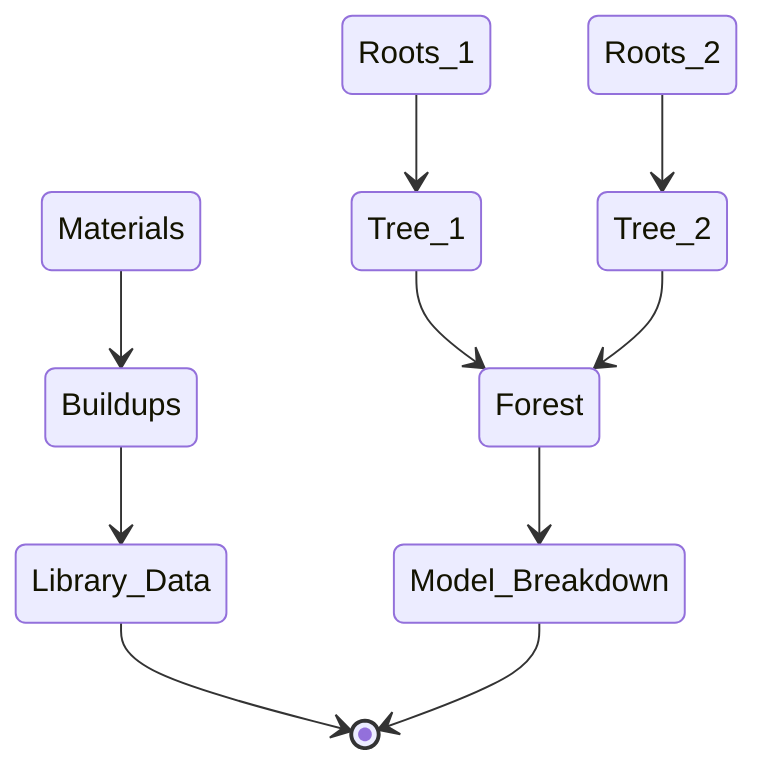
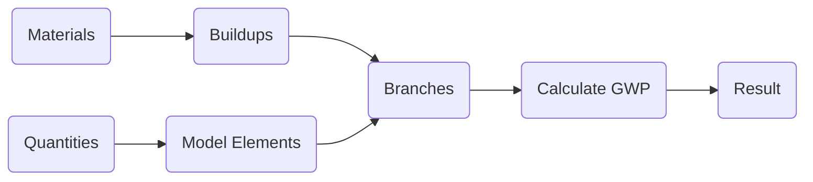
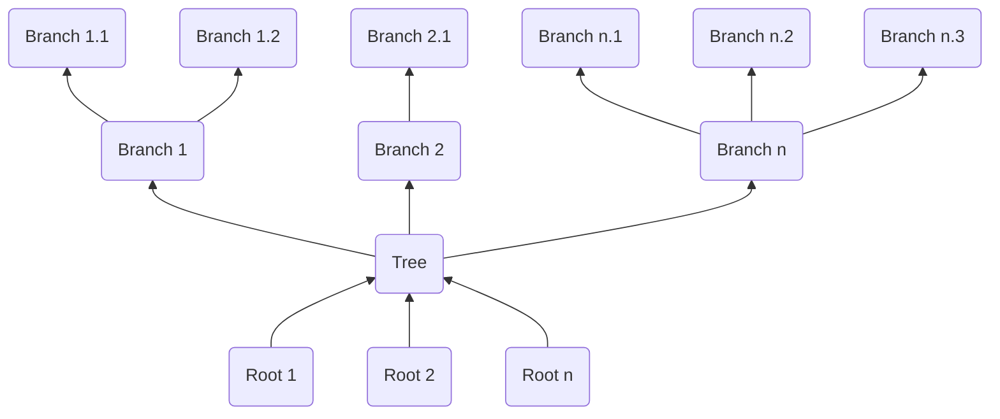
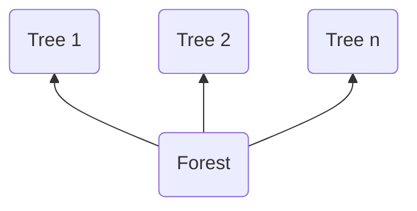
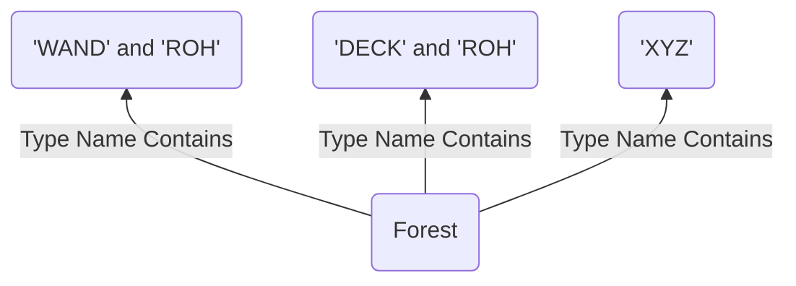
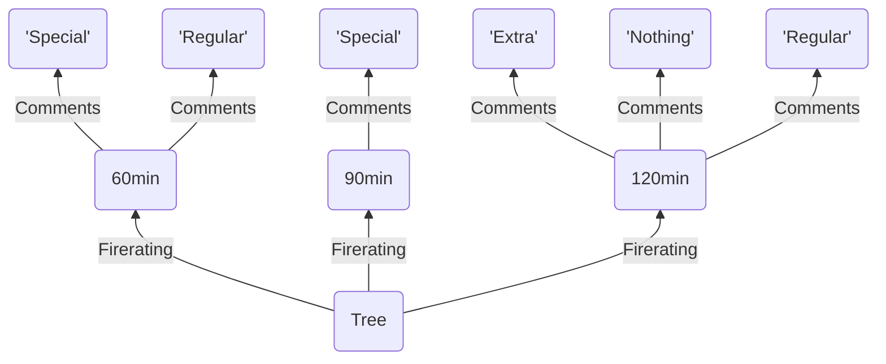
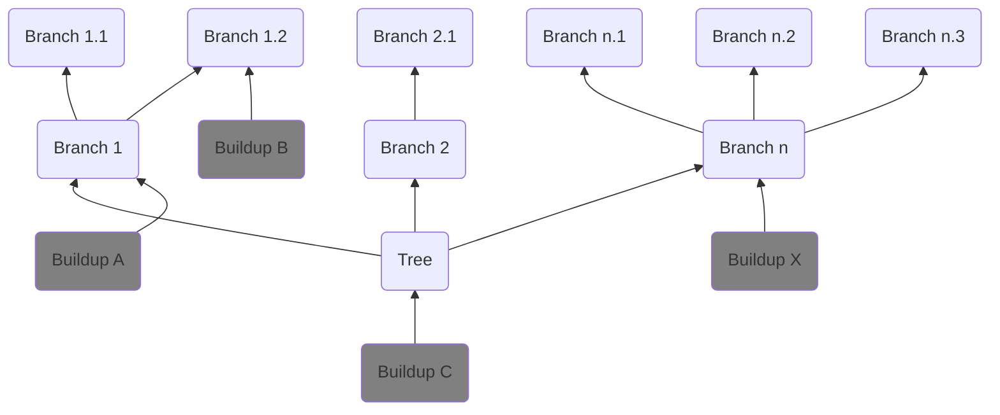

# Life Cycle Assessment
**Definition:**

*Life Cycle Assessment (LCA) is a tool used in architectural design to evaluate the environmental impacts of a building throughout its entire lifespan. It assesses factors like energy use, emissions, and waste generation from raw material extraction to demolition. By considering the life cycle perspective, architects can make informed decisions to minimize environmental burdens and create sustainable designs. LCA helps optimize building designs and promotes environmentally responsible practices in architecture.*

This tool currently focusses on Global Warming Potential (GWP) in the phases A1, A2 and A3.

# Method

## Goal

1. A full or partial mapping of model elements to buildups from a library.
2. Calculate GWP per element according to unit rate from the buildup.
3. Break-down or summarize result for timeline comparision.
4. Benchmark against previous projects.

## Usability

LCA analysis is mostly a data centric task which inherently means:

> Beware: :warning: Junk in -> Junk out :warning:   

Usability in this case means perfect control over your data.

> Control << Understanding << Visualization


## Terminology

Designing a tool that works for modelling standards around the globe is a challengeing task.
This method aims to be as simple as possible while mainaining maximum flexibility.
To explain how it works, we need to introduce a few terms:
- [Forest](#forest)
- [Tree](#tree-and-roots)
- [Roots](#tree-and-roots)
- [Branch](#branches)
- [Buildup](#buildups)
- [Mapping](#the-mapping)
- [Calculation Result](#results)

# Process

This guide attempts to explain the underlying logic of the [direcuts-lca](https://github.com/herzogdemeuron/directus-lca) class library. Understanding this is the main prerequisite for making you own front end applications like [revit-lca](https://github.com/herzogdemeuron/revit-lca)

The process is structured in two parts, where 1 is prerequisite to 2.
1. [Library Data](#library-data)
2. [Model Breakdown](#Model-Breakdown)



## Library Data

:grey_question: Why bother to make a central library for materials and buildups? Revit already has types and materials!

>- Revit does, Rhino does not.  
>- Determining the GWP of a material requires certain knowledge.   
>- Determining the kind and quantity of materials that make up a builup requires certain knowledge.   
>- We suggest that the materials and buildups you make available in your organization are **managed centrally by an expert**.   
>- We see a strong analogy to cost calculation.

### Materials

A material is exaclty what the name suggests: A single building material.  The material definition can be sourced from any reputable source there is. It can be estimated, averaged or copied from a database / EPD (Environmental Product Declarations). 
You are in charge.

Common sources are:
- OEKOBAUDAT (Germany)
- KBOB (Switzerland)
- EC3 (USA)
- LCAByg (Denmark)
- EPD's (Manufacturer)

> The expert is responsible for the relevancy of the associated GWP.

### Buildups

A buildup defines the GWP of one reference unit for a certain model element.
The reference units for a buildup are:
- Per piece (each)
- Cubic meters (m3)
- Square meters (m2)
- Meters (m)

A buildup is made up from one or more [Materials](#materials). Each material has a quantity associated, which tell you how much of this material is used per reference unit of the buildup.

### Results



## Model Breakdown

Breaking down the model into chunks of elements in a hierarchial manner allows us to map buildups to these chunks and/or override the mapping of a parent chunk by mapping a buildup to a sub-chunk.  
We chose the analogy of a forest full of trees with branches to make it easier to visualize what's happening.



### Forest

A **Forest** is a set of **Trees**:



A forest can be **saved** and **loaded**, this is the included information:
```
[
    {
        "Name": "Tree1",
        "Roots": [
            {
                "Parameter": "Type Name",
                "Method": "Parameter Contains Value",
                "Value": "WAND"
            },
            {
                "Parameter": "Type Name",
                "Method": "Parameter Contains Value",
                "Value": "ROH"
            }
        ],
        "BranchConfig": [
            "Firerating",
            "Comments"
        ]
    },
    {
        "Name": "Tree2",
        "Roots": [
            {
                "Parameter": "Type Name",
                "Method": "Parameter Contains Value",
                "Value": "DECK"
            },
            {
                "Parameter": "Type Name",
                "Method": "Parameter Contains Value",
                "Value": "ROH"
            }
        ],
        "BranchConfig": [
            "Firerating",
            "Comments"
        ]
    }
]
```
> Note that "Parameter Contains Value" is currently the only supported method for roots.

### Tree and Roots

A **Tree** defines a high level grouping of alike elements. It encapsulates the logic that unites these elements. That logic is called **Roots**. The Roots shown in the example above produce a forest like this:



### Branches

A tree can also define (optionally) by what property the alike element should be sub-grouped. The resulting sub-groups are called **Branches**.

Every **Branch** can have Subbranches. What elements belong to each subbranch is determined by their value of the property that is used to create the subbranches. This logic is called **BranchConfig**.

A **BranchConfig** is a simple list of property/parameter names. The BranchConfig ```["Firerating", "Comments"]``` generates a branch structure as shown below:



### The Mapping

You can **choose a buildup for any level** of the hierarchy. Buildup assignment is inherited by subbranches, if no buildup is explicitly specified.  

In the example below, Branch 1 and Branch 1.1 use Buildup A while Branch 1.2 uses Buildup B.



The **relationship** branch <--> buildup can be **saved** and **loaded**.  
Saving a mapping will include the following information, where evey item in the list is one Branch <--> buildup relationship.

```
[
    {
        "tree_name": "Structural Floors",
        "parameter": "Firerating",
        "value": "90min",
        "buildup_id": 1
    },
    {
        "tree_name": "Interior Walls",
        "parameter": "Firerating",
        "value": "90min",
        "buildup_id": 2
    }
]
```

> Note that the tree name is included for the relationship. This prevents errors when loading an existing mapping where you have e.g:   
> - "Firerating: 90min = Buildup A" for "Structural Floors"
> - "Firerating: 90min = Buildup B" for "Interior Walls"

# Directus
Class library for LCA tools that use [Directus](https://directus.io/) as a headless CMS

## Authentication
directus-lca uses environment variables for authentication with directus. There's two ways of doing this that come to my mind:

1. They are provided by the UI applications that use this class library. I'd say this is the default way. See [revit-lca](https://github.com/herzogdemeuron/revit-lca#readme) for reference.
2. They are present on a system-wide basis, aka you create them manually or your IT rolls them out to all machines in your company.

The names of the environment variables are `DIRECTUS_LCA_TOKEN` and `DIRECTUS_LCA_URL`. Note that the url is the graphql endpoint of your directus project.
