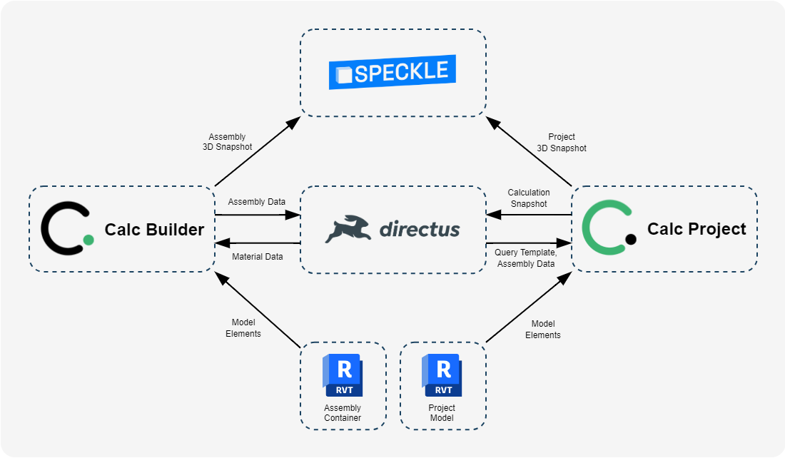
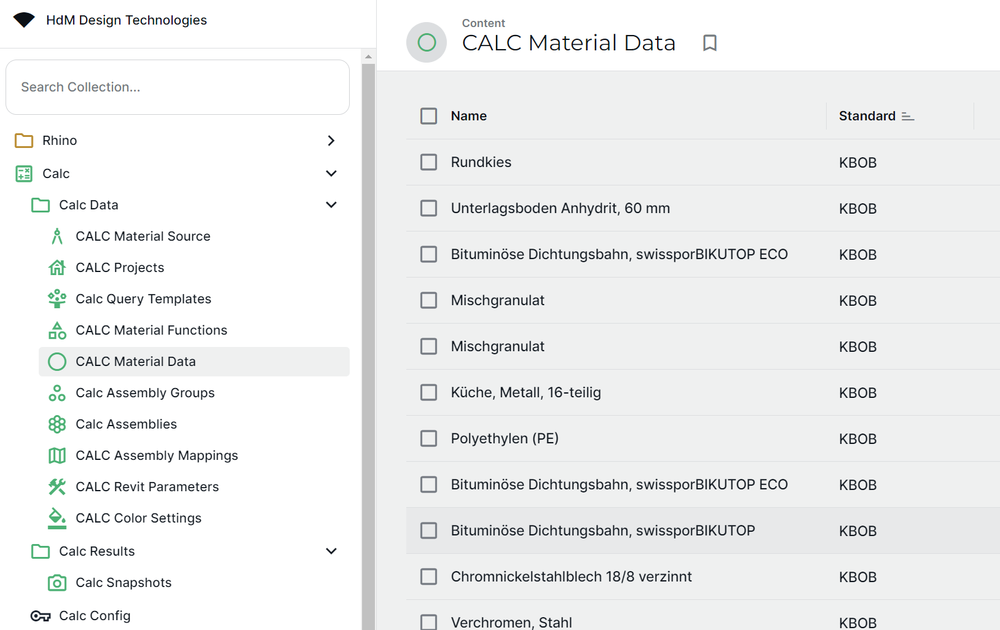
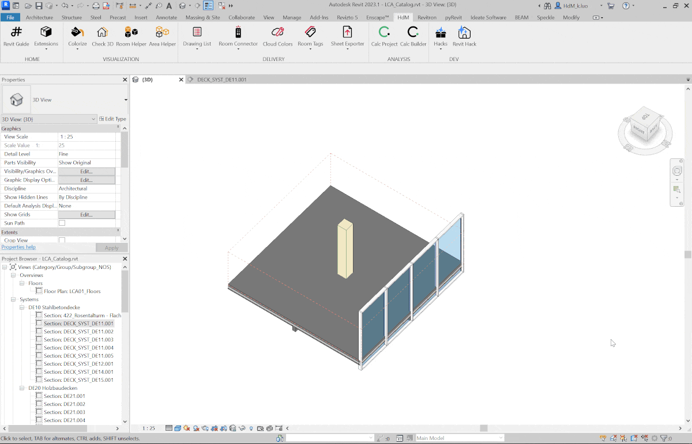
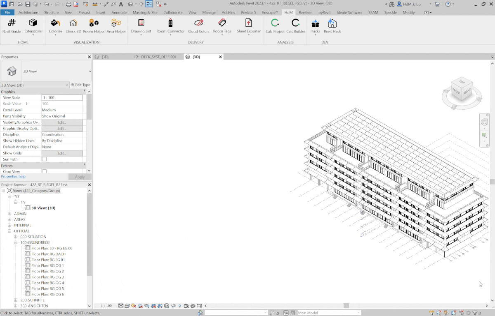

   <picture>
      <source media="(prefers-color-scheme: dark)" srcset="./images/icon_calc_light.png" width="180" height="180">
      
   </picture>

 

## Calc Overview
Calc is a tool for architects to rapidly assess the environmental impact of early design phases. Our open data approach leverages:
- **Autodesk Revit** for design authoring
- **Directus** for centralized database management
- **Speckle** for geometry snapshot handling and 3D dashboard visuals

This repository houses the core applications we've developed in-house to facilitate this workflow.

## Key Features
👪 Role-based data management with Directus UI

🧰 Custom assemblies using material data and Revit model groups

🧱 Efficient Revit project breakdown via query templates

🥅 Seamless assembly-to-model assignment

🤩 Real-time Revit visualization for model branching and assembly validation

👚 Automated calculations uploaded to Directus using Calc schema

## How it works
1. Configure material library and query templates in Directus

  

2. Use **Calc Builder** to design assemblies

  

3. Use **Calc Project** to assign assemblies to project query results and save calculation snapshots

  

## Get Started
👉 [Quick Start Guide](./quick_start)
