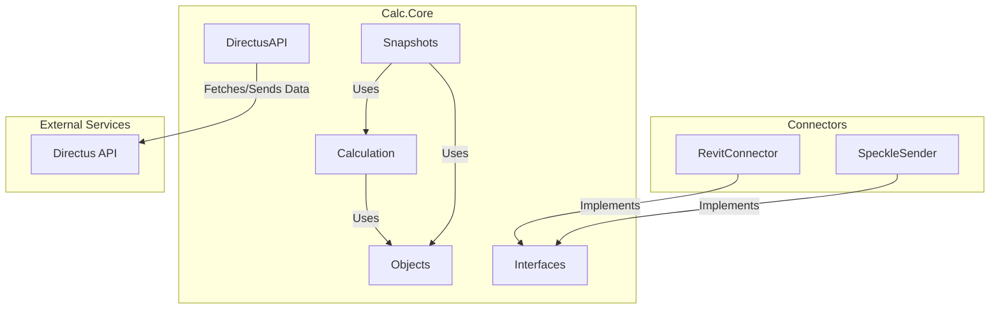

# Calc.Core Module

Back to [Overall Orchestration](../README.md)

The `Calc.Core` module is the heart of the `Calc` application. It contains all the essential business logic, data structures, and services, and is designed to be completely independent of any specific CAD host application like Revit.

## Architecture

The diagram below shows the main components within the `Calc.Core` module and how they interact with external services and other modules.

## Key Sub-Modules and Classes

### 1. `Objects`
This is the most critical part of the Core module. It defines all the fundamental data types (models) used throughout the application.

#### `Assemblies`
- **`Assembly`**: Represents a building assembly, containing a list of `AssemblyComponent`s and other metadata.
- **`AssemblyComponent`**: A single component within an assembly, typically a layer of material.
- **`AssemblyData`**: Holds the data for an assembly that is sent to Speckle.
- **`AssemblyRecord`**: A record of an assembly's composition, which gets serialized and stored in Revit.

#### `Elements`
- **`CalcElement`**: A host-agnostic representation of an element from the CAD model.
- **`CustomParamSetting`**: Defines settings for custom parameters to be extracted from elements.

#### `GraphNodes`
- **`Query`**: Represents a rule for filtering and selecting elements.
- **`QueryTemplate`**: A collection of `Query` objects that can be saved and reused.
- **`Branch`**: Represents a node in the query results tree structure.

#### `Mappings`
- **`Mapping`**: Defines a set of rules for mapping `CalcElement`s to `Assembly`s.
- **`MappingItem`**: A single rule within a `Mapping`.

#### `Materials`
- **`Material`**: Represents a building material and its associated environmental data.
- **`MaterialFunction`**: Describes the function of a material in an assembly (e.g., "Insulation").

### 2. `DirectusAPI`
This component handles all interactions with the Directus backend.
- **`DirectusManager`**: The main class for managing the connection and data retrieval from Directus.
- **`StorageDrivers`**: A set of classes, each responsible for fetching a specific type of data from Directus (e.g., `AssemblyDriver`, `MaterialDriver`, `QueryTemplateDriver`).

### 3. `Calculation`
This contains the logic for performing the environmental impact calculations.
- **`CalculationComponent`**: Represents a single item in a calculation result.

### 4. `Snapshots`
This component is responsible for creating immutable records of calculations.
- **`SnapshotMaker`**: The main class that generates snapshots.
- **`ProjectSnapshot`**: Represents the calculated results for an entire project at a specific point in time.
- **`AssemblySnapshot`**: Represents the calculated results for a single assembly.
- **`ProjectResult`**: A summary of the project results, which is sent to Directus.

### 5. `Interfaces`
To maintain its independence, `Calc.Core` defines a set of interfaces that act as a "contract" for host-specific "connector" modules.
- **`IElementCreator`**: Defines a method for creating `CalcElement`s.
- **`IElementSourceHandler`**: Defines methods for selecting elements in the host app.
- **`IImageSnapshotCreator`**: Defines a method for creating screenshots.
- **`IElementSender`**: Defines a method for sending geometry data to an external service (Speckle).
- **`IVisualizer`**: Defines methods for visualizing results in the host app (e.g., color-coding).
