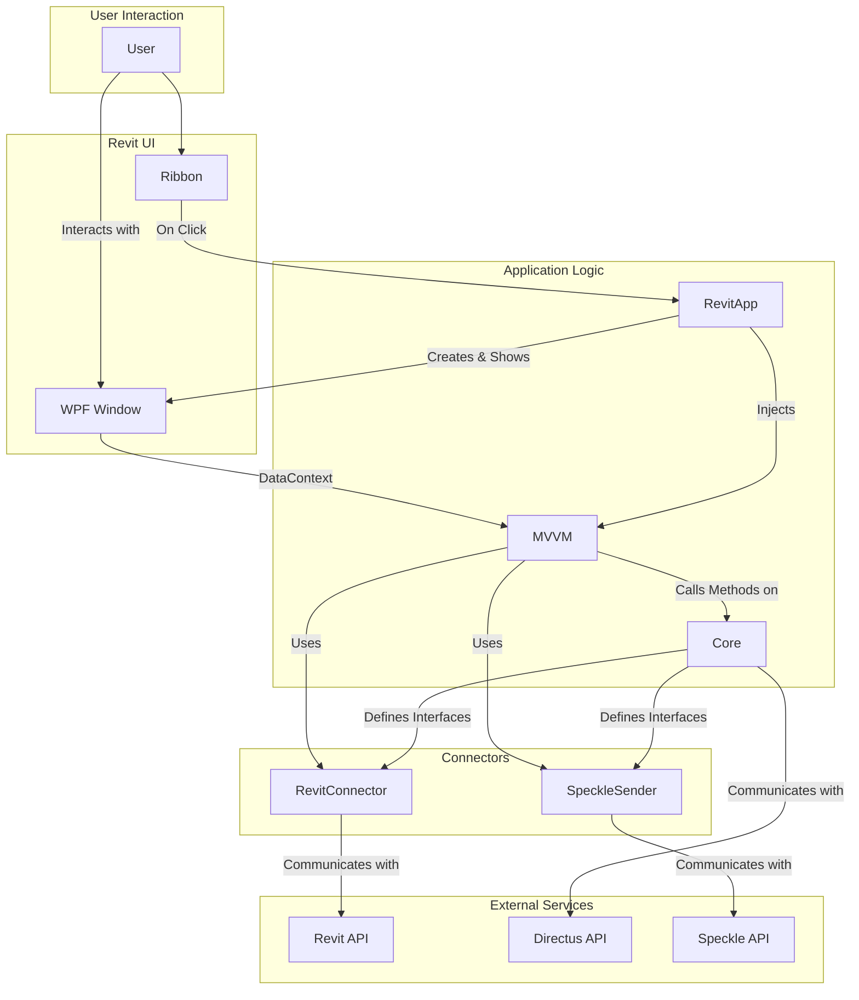

# Overall Orchestration

This document provides a high-level overview of the `Calc` application architecture. The application is designed with a modular and decoupled architecture to separate concerns, improve maintainability, and allow for future extensions.

## Architecture Overview

The diagram below illustrates the interaction between the different modules of the application and the external services it communicates with.

### Modules

*   **`Calc.Core`**: The central hub of the application. It contains the core business logic, data models, and services for communicating with the Directus backend. It is designed to be completely independent of any host application (like Revit).

*   **`Calc.RevitConnector`**: Acts as a bridge between the `Core` module and the Revit application. It implements the interfaces defined in `Core` to provide Revit-specific functionality, such as accessing model data and visualizing results.

*   **`Calc.SpeckleSender`**: A specialized connector responsible for sending geometry and data to Speckle. It implements the `IElementSender` interface from `Core` and handles the conversion of Revit elements to Speckle objects.

*   **`Calc.MVVM`**: The User Interface (UI) layer, built using the Model-View-ViewModel (MVVM) pattern with WPF. It provides the windows and controls that the user interacts with.

*   **`Calc.RevitApp`**: The entry point for the Revit add-in. It ties all the other modules together. It initializes the application, creates the Revit ribbon, and launches the UI.

### Dependency Injection and Interfaces

The key to the decoupled architecture is the use of **interfaces** and **dependency injection**.

1.  **Interfaces as Contracts**: The `Calc.Core` module defines a set of interfaces (e.g., `IElementCreator`, `IVisualizer`, `IElementSender`). These interfaces act as "contracts" that define what a connector module must be able to do, without specifying *how* it should be done.

2.  **Connectors as Implementations**: The `Calc.RevitConnector` and `Calc.SpeckleSender` modules implement these interfaces with Revit-specific code. For example, `RevitVisualizer` in the `RevitConnector` project implements the `IVisualizer` interface by calling the Revit API to change the color of elements in the model.

3.  **Wiring it all up**: The `Calc.RevitApp` module is responsible for "wiring up" the dependencies. When the application starts, it creates instances of the `RevitConnector` and `SpeckleSender` classes. It then passes these instances to the `ViewModel` of the `MVVM` module.

This approach means that the `Core` and `MVVM` modules don't need to know anything about Revit. They just operate on the interfaces. This makes the code easier to test and maintain. In theory, one could create a connector for a different application (e.g., ArchiCAD) by simply creating a new project that implements the same interfaces, without having to change the `Core` or `MVVM` logic.
