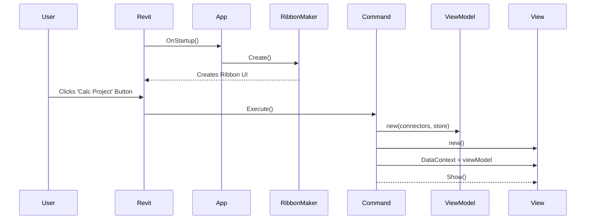

# Calc.RevitApp Module

Back to [Overall Orchestration](../README.md)

The `Calc.RevitApp` module is the main entry point for the Revit add-in. It is the "glue" that holds the application together, responsible for tying all the other modules together and integrating them into the Revit user interface.

## Application Startup Sequence

The diagram below illustrates the sequence of events when a user launches the `Calc` application from the Revit ribbon.

## Key Classes and Responsibilities

### `App.cs`
This is the primary class of the module, implementing the `IExternalApplication` interface from the Revit API. This is the first code to be executed when Revit loads the add-in.
-   **`OnStartup()`**: This method is called by Revit when it starts. It has two main jobs:
    1.  It calls `RibbonMaker.Create()` to build the add-in's UI in the Revit ribbon.
    2.  It hooks into the `AppDomain.CurrentDomain.AssemblyResolve` event. This is a crucial step for complex add-ins to help the .NET runtime locate and load the various DLLs (`Core`, `MVVM`, `RevitConnector`, etc.) from the correct directory.
-   **`OnShutdown()`**: This method is called by Revit when it closes. It's used for any necessary cleanup.

### `Revit/RibbonMaker.cs`
This is a static class responsible for creating the `Calc` ribbon panel and its buttons within the Revit UI.
-   **`Create()`**: This method builds the UI. It creates a "CALC" tab, adds a "Calc" panel, and then adds the two main buttons:
    -   **"Calc Builder"**: This button is linked to the `CalcBuilderCommand`.
    -   **"Calc Project"**: This button is linked to the `CalcProjectCommand`.
    It also assigns icons to the buttons.

### `Revit/CalcBuilderCommand.cs` and `Revit/CalcProjectCommand.cs`
These classes implement the `IExternalCommand` interface, which is the standard way to link a Revit button click to an action.
-   **`Execute()`**: This method is called when the user clicks the corresponding ribbon button. This is the critical point where the application is "wired up" and launched. The process is as follows:
    1.  A new `RevitExternalEventHandler` is created to handle communication from the UI back to Revit.
    2.  Instances of all the necessary connector classes are created (e.g., `RevitElementCreator`, `ElementSourceHandler`, `RevitVisualizer`, `ElementSender`).
    3.  A new `CalcStore` (from `Core`) is instantiated to hold the application's state.
    4.  A new main `ViewModel` (e.g., `BuilderViewModel` or `ProjectViewModel` from `MVVM`) is created. The connector instances and the `CalcStore` are passed into the `ViewModel`'s constructor. This is where the dependency injection happens.
    5.  A new main `View` (e.g., `CalcBuilderView` or `CalcProjectView`, the WPF windows) is created.
    6.  The `ViewModel` is set as the `DataContext` of the `View`, establishing the link for data binding.
    7.  Finally, the window is shown to the user.
