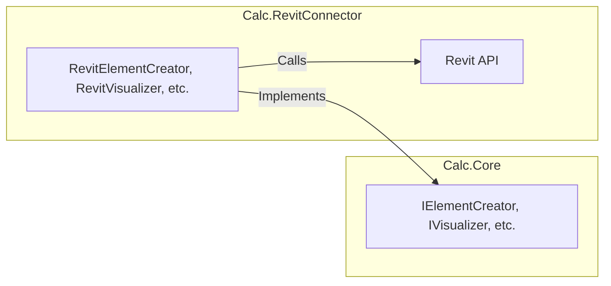

# Calc.RevitConnector Module

Back to [Overall Orchestration](../README.md)

The `Calc.RevitConnector` module serves as the bridge between the generic `Calc.Core` logic and the Autodesk Revit application. Its sole purpose is to implement the interfaces defined in `Calc.Core` using the Revit API.

## Architecture

The diagram below shows how the `RevitConnector` acts as a layer between the `Core` interfaces and the Revit API.

## Key Classes and Responsibilities

### `Revit` Folder

-   **`RevitElementCreator`**: Implements `IElementCreator`. This class is responsible for taking native Revit `Element` objects and converting them into the host-agnostic `CalcElement` objects used by the `Core` module. It extracts all the necessary parameters and properties from the Revit elements.

-   **`ElementSourceHandler`**: Implements `IElementSourceHandler`. This class manages the interactive selection of elements in the Revit UI, using Revit's `Selection` tools. It also handles the persistence of assembly definitions (`AssemblyRecord`) by serializing them as JSON and storing them in the `Type Comments` parameter of a Revit `GroupType`. This is a key mechanism for embedding `Calc` data within the Revit project file itself.

-   **`RevitImageCreator`**: Implements `IImageSnapshotCreator`. This class uses the Revit API to generate a temporary 3D view, isolate the relevant elements, and capture an image of them. This image is used as a thumbnail for the assembly in the `Calc Builder` UI.

-   **`RevitVisualizer`**: Implements `IVisualizer`. This class handles all visual feedback within the Revit model. It uses the Revit API's `OverrideGraphicSettings` to change the color and transparency of elements, allowing the user to visually identify which elements correspond to different queries or have certain calculation results.

-   **`RevitExternalEventHandler`**: This is a standard and crucial pattern in Revit API development. It allows the modeless WPF windows of the `MVVM` module to make changes to the Revit document. The Revit API requires all document modifications to be made within a valid Revit context (a "transaction"). This event handler creates a mechanism to safely queue and execute actions from the UI thread on the main Revit thread.

-   **`AssemblyComponentCreator`**: A helper class used by the `ElementSourceHandler` to create `AssemblyComponent` objects from selected Revit elements.

### `Helpers` Folder

-   **`ParameterHelper`**: A utility class that provides robust methods for getting and setting parameter values on Revit elements, handling different data types and potential errors.
-   **`SelectionHelper`**: A utility class that simplifies the process of prompting the user to select elements in the Revit UI.
