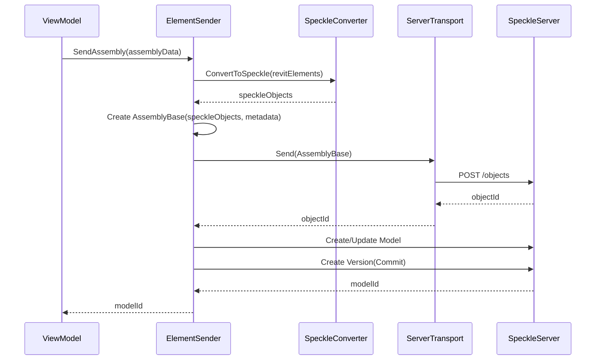

# SpeckleSender Module

Back to [Overall Orchestration](../README.md)

The `SpeckleSender` module is a specialized connector responsible for communicating with the Speckle platform. Its primary role is to send assembly geometry and associated data to a Speckle server for 3D visualization in a web-based dashboard.

## Data Flow to Speckle

The diagram below shows the process of sending an assembly to Speckle.

## Key Classes and Responsibilities

### `ElementSender.cs`
This is the main class in the module and implements the `IElementSender` interface from `Calc.Core`.
-   **Constructor**: Initializes the Speckle Kit converter for Revit and sets up the `Client` for communicating with the Speckle server, using connection details (`token`, `serverUrl`) from the `CalcConfig`.
-   **`SendAssembly(AssemblyData assemblyData)`**: This is the core method. It takes the `assemblyData`, which contains the Revit element IDs and other metadata, and performs the following steps:
    1.  It calls `CreateAssemblyBase()` to convert the Revit elements into a custom Speckle object.
    2.  It uses a `ServerTransport` to send the object to the specified Speckle project.
    3.  It checks if a "Model" for this assembly already exists in the Speckle project.
    4.  If a model doesn't exist, it creates a new one. If it does, it may update the model's name or description.
    5.  It creates a new "Version" (commit) in the model's branch, pointing to the newly sent object. This creates an immutable snapshot of the assembly in Speckle.
    6.  It returns the ID of the Speckle model.

### `AssemblyBase.cs`
This class defines a custom Speckle object (`Base`). Speckle's `Base` object works like a dynamic dictionary, allowing you to attach any custom data you want to it.
-   The `AssemblyBase` class is used to wrap the list of converted Speckle geometry objects.
-   It also attaches all the metadata from the `AssemblyData` (like `code`, `name`, `group`, etc.) as dynamic properties directly onto the `Base` object. This makes the data accessible in the Speckle web viewer and via the Speckle API.

### Caching (`RevitDocumentAggregateCache.cs`, `RevitObjectCache.cs`)
These classes are part of the Speckle SDK's mechanism for caching and improving the performance of element conversions. They help keep track of already converted objects to avoid redundant processing.
